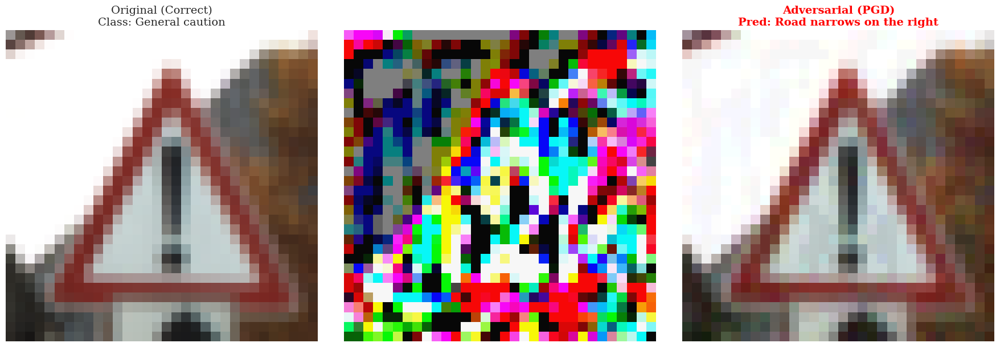

# Revisiting Madry's Defense: An Independent Study on Model Capacity and Adversarial Robustness

<p align="center">
  <b>Maël Trémouille</b> &middot; Antoine Germain &middot; Damien Fleurie<br>
  ENSAE Paris &middot; October 2025 – January 2026
</p>

<p align="center">
  <a href="Projet_AML.pdf"><b>Paper (PDF)</b></a> &middot;
  <a href="https://colab.research.google.com/github/Monthaonos/Advanced_machine_learning/blob/main/main.ipynb">
    
  </a>
</p>

---

This project is an independent, clean-room re-implementation of the [Madry et al. (ICLR 2018)](https://arxiv.org/abs/1706.06083) adversarial training framework. We investigate the relationship between **model capacity** and **adversarial robustness** across CIFAR-10 and the German Traffic Sign Recognition Benchmark (GTSRB), with extensions to momentum-based attacks (MIM), stochastic training regimes, and universal adversarial patches.

<p align="center">
  <br>
  <em>A "General caution" traffic sign is misclassified as "Road narrows on the right" after an imperceptible PGD perturbation (ε = 8/255).</em>
</p>

## Key Results

### Model capacity is a primary driver of robustness

Standard models (clean-trained) collapse to **~0% accuracy** under PGD on CIFAR-10 regardless of architecture. With adversarial training, higher-capacity models retain significant robustness:

| Architecture | Params | CIFAR-10 Clean Acc. | CIFAR-10 PGD Acc. | GTSRB Clean Acc. | GTSRB PGD Acc. |
|:---|---:|---:|---:|---:|---:|
| Simple CNN | ~4.3M | 63.4% | 39.3% | — | — |
| ResNet-18 | ~11M | 85.2% | 48.2% | 95.2% | 69.0% |
| **WideResNet-28-10** | **~36M** | **85.0%** | **47.8%** | **96.7%** | **69.0%** |

> WideResNet achieves **~48% robust accuracy** on CIFAR-10 and **69% on GTSRB** under 20-step PGD (ε=8/255), validating Madry's hypothesis that capacity is necessary for robustness.

### Stochastic training mitigates the accuracy-robustness trade-off

Pure adversarial training (P_train=1.0) maximizes robustness but imposes an "accuracy tax" on clean data. We introduce a **batch-wise probabilistic training** strategy that mixes clean and adversarial samples:

| Architecture | P_train | Clean Acc. | PGD Acc. | MIM Acc. |
|:---|---:|---:|---:|---:|
| Simple CNN | 1.0 | 63.4% | 39.3% | 39.9% |
| Simple CNN | **0.8** | **69.3%** | **40.1%** | **41.0%** |
| ResNet-18 | 1.0 | 85.2% | 48.2% | 46.5% |
| ResNet-18 | 0.5 | 88.0% | 46.8% | 45.1% |

> For the Simple CNN, P_train=0.8 **improves PGD robustness** (39.3% → 40.1%) **while gaining +6 points** of clean accuracy. Stochastic training acts as a regularizer that prevents "adversarial overfitting" in low-capacity models.

### Cross-norm robustness: L-infinity training transfers to L-0 patch attacks

We evaluate universal adversarial patches (25% image coverage) against both clean and robust models:

| Architecture | CIFAR-10 Clean ASR | CIFAR-10 Robust ASR | GTSRB Clean ASR | GTSRB Robust ASR |
|:---|---:|---:|---:|---:|
| Simple CNN | 89.7% | **14.8%** | 93.6% | 55.6% |
| ResNet-18 | 71.3% | **27.1%** | 64.8% | 51.4% |
| WideResNet | 67.3% | **31.0%** | 71.9% | 53.1% |

> L-infinity adversarial training dramatically reduces patch vulnerability: ASR drops from **89.7% to 14.8%** for Simple CNN on CIFAR-10, revealing a significant **cross-norm transfer** of robustness. Models trained against global perturbations develop a structural "shape-bias" that partially resists localized attacks.

## Contributions

1. **Capacity Analysis** — Empirically verify that model capacity is necessary for adversarial robustness by contrasting Simple CNN, ResNet-18, and WideResNet-28-10 across two datasets.
2. **Stochastic Regularization** — Propose and evaluate a probabilistic training strategy (P_train) that provides a tunable accuracy-robustness trade-off, particularly effective for low-capacity models.
3. **First-Order Universality** — Confirm that PGD robustness generalizes to other first-order attacks, specifically the Momentum Iterative Method (MIM).
4. **Safety-Critical Extension & Cross-Norm Robustness** — Extend evaluation to GTSRB (autonomous driving) and show that L-infinity training provides significant, albeit incomplete, resilience against L-0 patch attacks.

## Method

The framework solves the min-max saddle point problem from [Madry et al.](https://arxiv.org/abs/1706.06083):

$$\min_{\theta} \mathbb{E}_{(x,y) \sim \mathcal{D}} \left[ \max_{\delta \in \mathcal{S}} L(f_\theta(x+\delta), y) \right]$$

- **Inner maximization**: Find worst-case perturbations via PGD (ε=8/255, α=2/255, K=6 steps during training)
- **Outer minimization**: Update model weights to minimize adversarial loss
- **Evaluation attacks**: Clean, FGSM (1-step), PGD-20, MIM (momentum-based)
- **Patch attack**: Universal L-0 adversarial sticker optimized via gradient ascent with spatial invariance

### Architectures

| Model | Key Features | Recommended For |
|:---|:---|:---|
| **Simple CNN** | VGG-style, 4 conv layers, ~4.3M params | Baseline / fast experiments |
| **ResNet-18** | Residual connections, adapted for 32x32 (no initial MaxPool) | GTSRB (geometric simplicity) |
| **WideResNet-28-10** | Pre-activation blocks, width factor 10, ~36M params | Adversarial training (high capacity) |

## Project Structure

```
├── main.py                    # Pipeline orchestrator (Phase 1/2/3)
├── main.ipynb                 # Interactive demo notebook
├── config.toml                # Production config (ResNet-18 on GTSRB)
├── config_mini.toml           # Smoke test config (SimpleCNN on CIFAR-10)
├── Projet_AML.pdf             # Full research paper
├── services/
│   ├── attacks.py             # FGSM, PGD, MIM, Universal Patch
│   ├── training.py            # Phase 1: Clean & adversarial training
│   ├── evaluation.py          # Phase 2: L-inf robustness benchmarking
│   ├── patch_service.py       # Phase 3: L-0 patch analysis & visualization
│   ├── core.py                # Madry training loop logic
│   ├── evaluator.py           # Metric computation
│   ├── storage_manager.py     # Checkpoint persistence
│   ├── config_manager.py      # TOML config parsing
│   ├── models/
│   │   ├── factory.py         # Model factory with NormalizeLayer
│   │   ├── simple_cnn.py      # VGG-style CNN
│   │   ├── resnet.py          # ResNet-18 (32x32)
│   │   └── wideresnet.py      # WideResNet-28-10
│   └── dataloaders/
│       ├── factory.py         # Dataset factory
│       ├── cifar10_loader.py  # CIFAR-10 pipeline
│       └── gtsrb_loader.py    # GTSRB pipeline
├── checkpoints_*/             # Trained model weights (.pth)
└── results_*/                 # CSV reports & visualizations
```

## Usage

### Installation

```bash
git clone https://github.com/Monthaonos/Advanced_machine_learning.git
cd Advanced_machine_learning
pip install -r requirements.txt
```

### Training & Evaluation

```bash
# Phase 1: Train clean + robust models
python main.py --config config.toml --train --prefix experiment_1

# Phase 2: Evaluate under FGSM, PGD, MIM attacks
python main.py --config config.toml --eval --prefix experiment_1

# Phase 3: Universal patch analysis
python main.py --config config.toml --patch --prefix experiment_1

# Run all phases
python main.py --config config.toml --train --eval --patch --prefix experiment_1
```

### CLI Overrides

Any TOML parameter can be overridden from the command line:

```bash
# Quick smoke test on CIFAR-10
python main.py --config config_mini.toml --dataset cifar10 --model simple_cnn --epochs 5 --train --eval

# Stochastic training sweep
python main.py --config config.toml --train_prob 0.8 --train --eval --prefix stochastic_08
```

### Configuration

All parameters are managed via `config.toml`:

| Section | Parameter | Description |
|:---|:---|:---|
| `[project]` | `device` | `cuda`, `mps` (Apple Silicon), or `cpu` |
| `[data]` | `dataset` | `cifar10` or `gtsrb` |
| `[model]` | `architecture` | `simple_cnn`, `resnet18`, or `wideresnet` |
| `[training]` | `epochs` | Training epochs (30 for CNN, 100 for ResNets) |
| `[adversarial]` | `epsilon` | L-inf perturbation budget (default: 8/255) |
| `[adversarial]` | `train_prob` | Probability of adversarial batch (P_train) |
| `[patch_attack]` | `scale` | Patch coverage as fraction of image area |

## References

- Madry, A., Makelov, A., Schmidt, L., Tsipras, D., & Vladu, A. (2018). *Towards Deep Learning Models Resistant to Adversarial Attacks*. ICLR.
- Dong, Y., Liao, F., Pang, T., Su, H., Zhu, J., Hu, X., & Li, J. (2018). *Boosting Adversarial Attacks with Momentum*. CVPR.
- Brown, T. B., Mane, D., Roy, A., Abadi, M., & Gilmer, J. (2017). *Adversarial Patch*. arXiv:1712.09665.
- Tsipras, D., Santurkar, S., Engstrom, L., Turner, A., & Madry, A. (2019). *Robustness May Be at Odds with Accuracy*. ICLR.
- Zagoruyko, S. & Komodakis, N. (2016). *Wide Residual Networks*. BMVC.
- He, K., Zhang, X., Ren, S., & Sun, J. (2016). *Deep Residual Learning for Image Recognition*. CVPR.
- Goodfellow, I. J., Shlens, J., & Szegedy, C. (2014). *Explaining and Harnessing Adversarial Examples*. arXiv:1412.6572.
- Stallkamp, J., Schlipsing, M., Salmen, J., & Igel, C. (2012). *Man vs. Computer: Benchmarking Machine Learning Algorithms for Traffic Sign Recognition*. Neural Networks.
